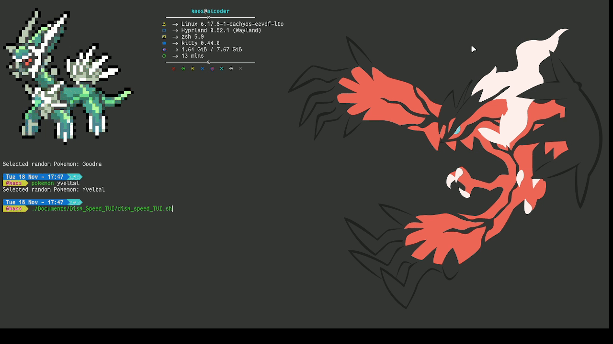

# Disk Speed Test - Interactive TUI


A lightweight, interactive bash script that measures disk read and write speeds with real-time progress bars and live speed calculations.

## Features

### Core Functionality
- **Real-time Progress Bars** - Visual feedback with percentage completion for both read and write tests
- **Live Speed Calculations** - Watch MB/s speed update in real time as each chunk completes while the progress line reports MB counters.
- **Interactive TUI** - Clean, user-friendly terminal interface with colored output plus disk/test parameter headers and per-run chunk details.
- **Results Summary** - Final report showing both write and read speeds

### Technical Highlights
- ⏲️ **Nanosecond-accurate timing** (±1 ms precision) using Bash's `%N` epoch for reliable results even on NVMe drives exceeding 3 GB/s
- 📊 **Colorful ncurses-style UI** using only `tput` (zero external dependencies beyond coreutils)
- ⛓️‍💥 **Chunked dd execution** with seek/skip + `conv=notrunc` for accurate progress reporting without sacrificing performance
- 🌪️ **Proper cache flush via `sync`** for honest write speeds (no RAM-cached fake results)
- 📝 **Fully configurable** via environment variables (file size, block size, chunk granularity, custom paths)
- 🧹 **Graceful cleanup** with `trap EXIT`, safe `mktemp` usage, and cursor state restoration
- 📖 **Human-readable suffixes parser** (K/M/G/T) identical to dd/gnu tools
- 🖥️ **Cross-platform compatible** on Linux and macOS

### Data Integrity
- **Accurate Measurements** - Chunked `dd` calls (default 10 MB per chunk) with a single `sync` flush keep process overhead low while preserving accuracy.
- **Unique Temporary Files** - Each run creates its own temporary test file via `mktemp` (or uses a custom `TEST_FILE` you export) and cleans it up automatically.
- **Results are realistic and repeatable** — ideal for quickly comparing HDDs, SSDs, NVMe, RAID arrays, or encrypted volumes

## Requirements

- Bash 4.0+
- `dd` command (standard on most Unix-like systems)
- `bc` for floating-point calculations
- `awk` for formatting and size math
- `mktemp` for creating isolated test files
- At least 500MB of free disk space

## Installation

```bash
git clone <repository-url>
cd disk-speed-test
chmod +x disk_speed_TUI.sh
```

## Usage

```bash
./disk_speed_TUI.sh
```

The script will:
1. Display a header with test information
2. Run the write speed test (creates 500MB file with progress bar)
3. Run the read speed test (reads the file back with progress bar)
4. Clean up temporary test files
5. Display a summary with final speeds in MB/s
6. Prompt you to press Enter to exit

## Output Example

```
╔═══════════════════════════════════════════════╗
║      💾 Disk Speed Test - Interactive TUI     ║
╚═══════════════════════════════════════════════╝

Starting Write Speed Test...
File Size: 500 MB | Location: /home/user/.speed_test_temp

Write Test      [========================================] 100% 450.25 MB/s

✓ Write Speed: 450.25 MB/s (1109ms)

Starting Read Speed Test...
File Size: 500 MB | Location: /home/user/.speed_test_temp

Read Test       [========================================] 100% 1200.50 MB/s

✓ Read Speed: 1200.50 MB/s (416ms)

=== Test Results ===

  Write Speed:         450.25 MB/s
  Read Speed:          1200.50 MB/s
```

## Demo Video



## How It Works

Every run generates a unique temporary test file via `mktemp` (you can still override the location by exporting `TEST_FILE` before running the script). The test size remains 500MB, but the script now writes and reads that data in chunked batches (default 10MB per progress update) to lower per-iteration overhead while keeping the TUI responsive.

### Write Test
- Creates the test file by writing `CHUNK_BLOCKS`-sized segments (default 10MB) with `dd`, using `seek` to append each subsequent chunk.
- Drops per-block syncing in favor of a single `sync` after all chunks have been written, while still displaying chunk-level speed and MB counters.
- Tracks elapsed time through the whole test so live MB/s values stay accurate as the progress bar advances.

### Read Test
- Reads the same file back in matching chunk sizes using `skip` to jump to each chunk in turn.
- Measures elapsed time after every chunk so the progress bar reflects MB counters plus MB/s speed.

### Cleanup
- Automatically removes the uniquely named temporary test file after completion
- Removes temporary speed result files

## Customization

You can modify these variables at the top of the script or set them via environment before running:

```
TEST_FILE=""                        # Optional: Provide a path, otherwise the script uses mktemp for uniqueness
FILE_SIZE="500M"                    # Total size to test
BLOCK_SIZE="1M"                     # Size per block
TOTAL_BLOCKS=500                      # Number of blocks
CHUNK_BLOCKS=10                       # Blocks per progress chunk (default 10 = 10MB progress updates)
```


## Performance Considerations

- **Accuracy**: Chunked `dd` writes avoid per-block fsync while a final `sync` keeps throughput realistic.
- **Chunking**: Default 10MB chunk size cuts down on process startup overhead but still delivers live MB counters for every update.
- **Block Size**: 1MB blocks keep progress steady; adjust `BLOCK_SIZE` and `CHUNK_BLOCKS` together if you want coarser chunks.
- **Test Duration**: Full test typically takes 30-60 seconds depending on disk speed.
- **Temporary Files**: Each run uses `mktemp` for an isolated file (override with `TEST_FILE` if you need a fixed path).

## Troubleshooting

### Script won't run
```bash
chmod +x disk_speed_TUI.sh
```

### "bc: command not found"
Install bc:
```bash
# Ubuntu/Debian
sudo apt-get install bc

# macOS
brew install bc

# Fedora/RHEL
sudo dnf install bc
```

### Not enough disk space
The script requires 500MB of free space. You can reduce `TOTAL_BLOCKS` or `FILE_SIZE` if needed.

### Inaccurate results
- Ensure no other processes are writing to the disk
- Close unnecessary applications to reduce I/O contention
- Run multiple times and average the results for consistency

## Color Coding

- **Blue**: Section headers and test starts
- **Green**: Success messages and live speed values
- **Yellow**: Warnings and prompts
- **Cyan**: Labels and test result headers

## License

MIT License - Feel free to use and modify as needed.

## Contributing

Contributions are welcome! Feel free to submit issues or pull requests for improvements.
